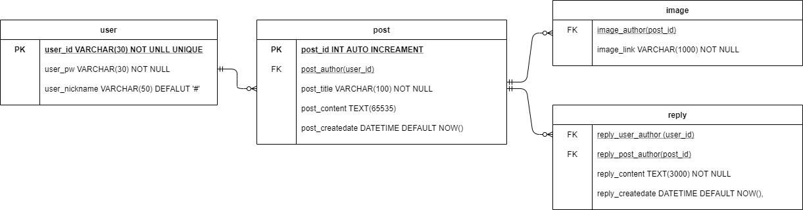

# crewSNS-front
### React/Redux/Redux-Thunk/Antdesign UI 를 사용한 SNS서비스 :: [프론트앤드]

---
## 2021.01.08
### `main.js login.js notLogin.js`컴포넌트 구현
- 해당 컴포넌트는 첫 화면에 보여지는 화면으로 좌측에 로그인할 수 있는 컴포넌트와 중앙에 `post.js`인 포스트 데이터들을 볼 수 있다.
- `login.js` :: 로그인을 하지 않았을 경우 보여지는 컴포넌트로, 로그인 or 회원가입을 선택할 수 있다.
- `notLogin.js` :: 로그인을 했을 경우 보여지는 화면으로, 사용자 닉네임과 로그아웃을 선택할 수 있다.

## 2021.01.09
### `post.js`컴포넌트 구현
- `React.layz`를 `post.js`컴포넌트에 적용
  > ```javascript
  > //Suspense를 import
  > import React, { Suspense } from 'react';
  > 
  > //component를 impor할 때 React.lazy()를 사용한다
  > const Post = React.lazy(() => import('./post'));
  > 
  > //import한 post컴포넌트는 Suspense로 감싸주고 fallback은 post컴포넌트가 보여지기 전까지 보여줄 내용을 적어준다.
  > <Suspense fallback={<div>loading...</div>}>
  >     <Post />
  > </Suspense>
  > ```
- `post.js`컴포넌트 image에 [react-layzload](https://www.npmjs.com/package/react-lazyload) 적용
  >```javascript
  >//내가 설정한 옵션
  ><LazyLoad offset={100} scroll="true" placeholder={<div>loading...</div>} height="300px"></LazyLoad>
  >```
  > 
- 테스트 이미지는 [unsplash](https://unsplash.com/) 사용

## 2021.01.10
### `signUp.js`컴포넌트 구현

## 2021.01.12
### crewSNS DB설계 작업
- ERD 설계 이미지


위에 이미지에 보여지는 것처럼 ERD를 만들어 보았다. 해당 ERD를 만들면서도 이렇게 연결을 하는 것이 맞는지, 해당키를 
기본키, 외래키로 설정해도 되는지 많은 고민을 하였다. 결과적으로는 구글 검색을 하며 내가 아는 지식을 동원하여 설계를 해보았고 실제 생성과 데이터 값 입력은 문제가 없어 해당 ERD구조로 진행할 것이며, 문제가 발생할 경우 바로 수정할 예정이다.
